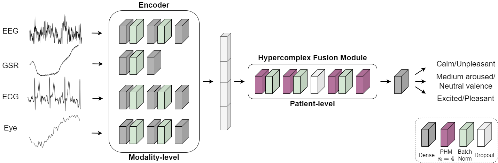

## Hypercomplex Multimodal Emotion Recognition from EEG and Peripheral Physiological Signals :performing_arts:

Official PyTorch repository for Hypercomplex Multimodal Emotion Recognition from EEG and Peripheral Physiological Signals, ICASSPW 2023.

Elenora Lopez, Eleonora Chiarantano, [Eleonora Grassucci](https://sites.google.com/uniroma1.it/eleonoragrassucci/home-page) and [Danilo Comminiello](https://danilocomminiello.site.uniroma1.it/)

[[IEEEXplore](https://ieeexplore.ieee.org/abstract/document/10193329)][[ArXiv Preprint](https://arxiv.org/abs/2310.07648)]

### Abstract :blush:

Multimodal emotion recognition from physiological signals is receiving an increasing amount of attention due to the impossibility to control them at will unlike behavioral reactions, thus providing more reliable information. Existing deep learning-based methods still rely on extracted handcrafted features, not taking full advantage of the learning ability of neural networks, and often adopt a single-modality approach, while human emotions are inherently expressed in a multimodal way. In this paper, we propose a hypercomplex multimodal network equipped with a novel fusion module comprising parameterized hypercomplex multiplications. Indeed, by operating in a hypercomplex domain the operations follow algebraic rules which allow to model latent relations among learned feature dimensions for a more effective fusion step. We perform classification of valence and arousal from electroencephalogram (EEG) and peripheral physiological signals, employing the publicly available database MAHNOB-HCI surpassing a multimodal state-of-the-art network.

### HyperFuseNet :smirk:



### How to use :scream:

#### Install requirements

`pip install -r requirements.txt`

#### Data preprocessing

1) Download the data from the [official website](https://mahnob-db.eu/hci-tagging/).
2) Preprocess the data: `python data/preprocessing.py`
   - This will create a folder for each subject with CSV files containing the preprocessed data and save everything inside `args.save_path`.
   
4) Create torch files with augmented and split data: `python data/create_dataset.py`
   - This performs data splitting and augmentation from the preprocessed data in step 2.
   - You can specify which label to consider by setting the parameter `label_kind` to either `Arsl` or `Vlnc`.
   - The data is saved as .pt files which are used for training.

#### Training

- To train with specific hyperparameters run: `python main.py`
  - Optimal hyperparameters for arousal and valence can be found in the arguments descriprion.
- To run a sweep run: `python sweep.py`

Experiments will be directly tracked on [Weight&Biases](https://wandb.ai/).

### Cite

Please, cite our work if you found it useful.

```
@inproceedings{lopez2023hypercomplex,
  title={Hypercomplex Multimodal Emotion Recognition from EEG and Peripheral Physiological Signals},
  author={Lopez, Eleonora and Chiarantano, Eleonora and Grassucci, Eleonora and Comminiello, Danilo},
  booktitle={2023 IEEE International Conference on Acoustics, Speech, and Signal Processing Workshops (ICASSPW)},
  pages={1--5},
  year={2023},
  organization={IEEE}
}
```

### Want more of hypercomplex models? :busts_in_silhouette:

Check out:

* Multi-View Breast Cancer Classification via Hypercomplex Neural Networks, _under review at TPAMI_, 2022 [[Paper](https://arxiv.org/abs/2204.05798)][[GitHub](https://github.com/ispamm/PHBreast/)]
* PHNNs: Lightweight neural networks via parameterized hypercomplex convolutions, _IEEE Transactions on Neural Networks and Learning Systems_, 2022 [[Paper](https://ieeexplore.ieee.org/document/9983846)][[GitHub](https://github.com/elegan23/hypernets)].
* Hypercomplex Image- to- Image Translation, _ICASSP_, 2022 [[Paper](https://ieeexplore.ieee.org/document/9892119)][[GitHub](https://github.com/ispamm/HI2I)]
